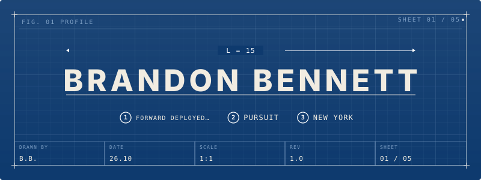
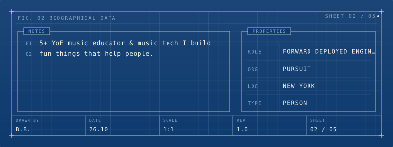
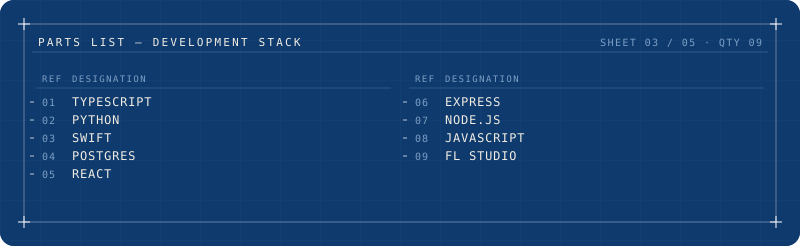
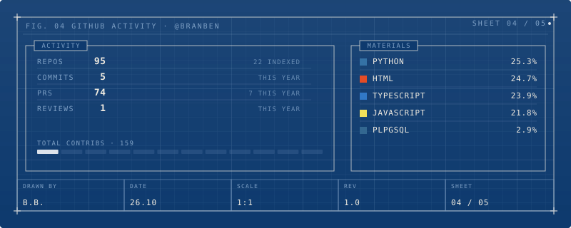
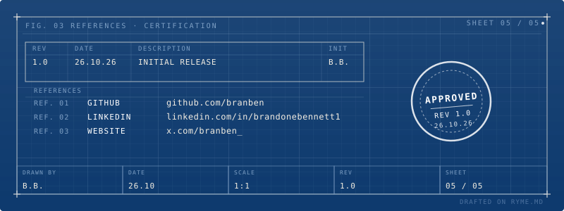

  

  
  
  
  

---

  

---

### 🎵 Sound Royale — Music Battle Platform

> Building the future of competitive music. A full-stack platform where artists compete in real-time battles, fans vote and the best tracks rise to the top.

.full-stack platform with real-time battle mechanics, payment integration (Stripe), AI-powered judging (OpenAI, Anthropic, Google Gemini), and a React frontend. Features include bracket-style tournaments, fan voting with virtual currency, live leaderboards, and social sharing.

**Frontend:** 110+ unit tests (Vitest), 0 TypeScript errors, component library with Glassmorphism/Minimalism/Bento Grid styles
**Backend:** Django REST Framework, 70+ API endpoints, JWT auth, Stripe webhooks, OpenAI integration

*Actively developing — targeting launch in 2026.*

---

### ⚡ [OmniRoute](https://github.com/diegosouzapw/OmniRoute) — Open Source Contributor

> One endpoint. 160+ providers. 50+ free. Connect Claude Code, Codex, Cursor, Cline & Copilot to free Claude/GPT/Gemini.

Active contributor to the [OmniRoute](https://github.com/diegosouzapw/OmniRoute) project (5.7k+ stars). The unified AI proxy/router that makes advanced AI accessible to everyone.

**Contributions:**
- 🔒 **[#2958](https://github.com/diegosouzapw/OmniRoute/pull/2958) — MCP Scope Enforcement Fix** — Fixed critical bug where dynamic tool groups (memory, skills, plugins, compression, gamification) were blocked when scope enforcement was enabled. Reordered guard logic in `evaluateToolScopes()` and added inline scope support to 33 dynamic tool definitions across 5 files. Credited in v3.8.8 CHANGELOG.
- 🔌 **[#2959](https://github.com/diegosouzapw/OmniRoute/pull/2959) — Notion MCP Context Source** — 6 MCP tools (`notion_search`, `notion_list_databases`, `notion_query_database`, `notion_read`, `notion_append_blocks`, `notion_get_database`), dashboard UI tab, read/write scope separation, 20 unit tests

---

### 💎 [OmniRoute Sync](https://github.com/branben/obsidian-omniroute-sync) — Obsidian Community Plugin

> Sync your vault between desktop and mobile over Tailscale. No cloud services required.

A standalone Obsidian community plugin for vault-to-vault sync over Tailscale. Smart frontmatter filtering, backlink-aware prioritization, and end-to-end push verification.

**Features:**
- 🔀 Bidirectional sync over Tailscale (no cloud)
- 🏷️ Smart frontmatter filtering (skips private/personal/draft notes)
- 🔗 Backlink-aware prioritization (connected notes sync first)
- ✅ End-to-end push verification (mtime confirmation)
- 🤝 Conflict resolution (keep local/remote/keep-both)
- 🐛 Per-category debug logging with in-plugin viewer
- 🛡️ Rate limiting (120 req/min per IP)

---

### 🤖 [MCP Rust SDK](https://github.com/modelcontextprotocol/rust-sdk) — Contributor

> Working on JSON Schema 2020-12 alignment for tool schemas.

**PR [#895](https://github.com/modelcontextprotocol/rust-sdk/pull/895) — SEP-2106: Relax `outputSchema` type gate**
- Split `validate_and_strip` into input/output variants: `inputSchema` keeps `type: "object"`; `outputSchema` now accepts any JSON Schema root type
- Updated `with_output_schema` docs
- 17 new tests for primitives, arrays, compositions, unit type, `Json<T>`, `ToolBase`, cache correctness, and input rejection
- Status: approved by DaleSeo, queued for **2026-07-28 merge batch**

---

- 🔬 **Photonics Tracker** — ICT/SMC backtesting engine for equities. 5m intraday strategy targeting 95% win-rate with confluence-based position sizing and killzone-only execution.

---

  

---

  

---

  

